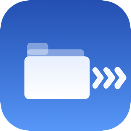
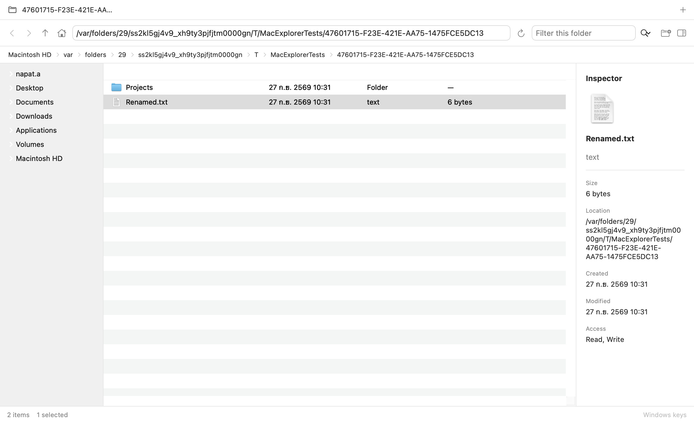
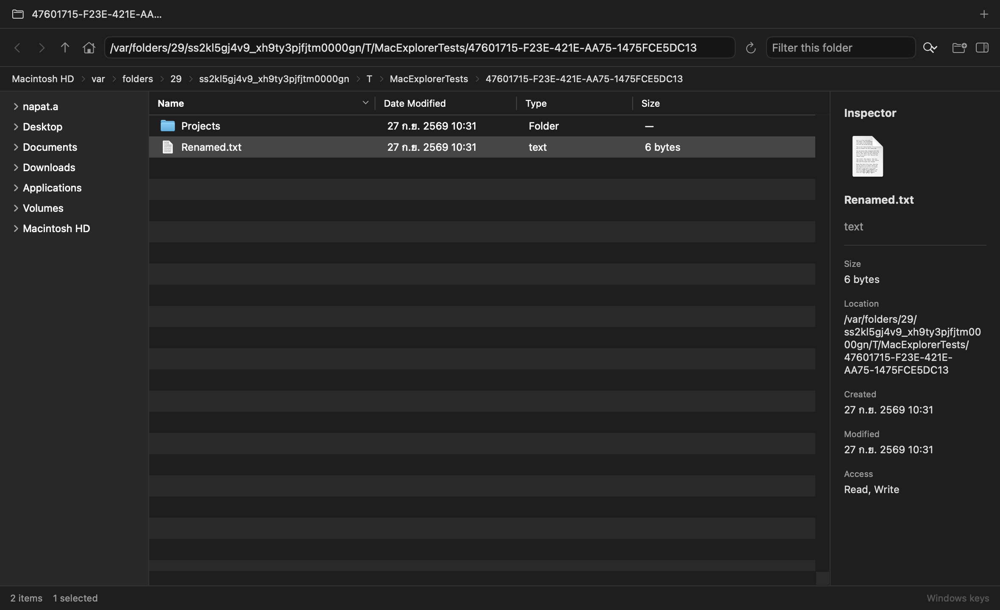

# MacExplorer

**ตัวจัดการไฟล์สำหรับ macOS ที่ใช้งานแบบ Windows Explorer —
A native macOS file manager with Explorer workflows.**

| Light | Dark |
| ----- | ---- |
|  |  |

---

## ภาษาไทย

MacExplorer คือแอปจัดการไฟล์บน macOS ที่ใช้ถนัดแบบ Windows Explorer
(address bar, folder tree, `Ctrl+C/X/V`, `F2`, Delete ลง Trash)
แต่ทำงานแบบแอป macOS แท้ ๆ (Quick Look, Spotlight, Light/Dark Mode)

**ความเป็นส่วนตัว:** ไม่มีบัญชีผู้ใช้ ไม่มีเซิร์ฟเวอร์ ไม่เก็บข้อมูลการใช้งาน
ไม่มีโฆษณา ทำงานกับไฟล์ในเครื่องเท่านั้น

### ดาวน์โหลดและติดตั้ง

1. ไปที่ [Releases](https://github.com/xArmeriumx/macexplorer-app/releases)
   ดาวน์โหลด `MacExplorer.dmg` และ `MacExplorer.dmg.sha256`
2. ตรวจสอบไฟล์: `shasum -a 256 -c MacExplorer.dmg.sha256` (ต้องขึ้น `OK`)
3. เปิด DMG แล้วลาก `MacExplorer.app` ไปที่ Applications
4. เปิดครั้งแรก: คลิกขวาที่แอป → Open → Open (เพราะเป็น build แบบ ad-hoc signed)

**ต้องการ:** macOS 14 ขึ้นไป, Apple Silicon หรือ Intel

### วิธีใช้งานเบื้องต้น

- พิมพ์ path ตรง address bar (`Ctrl+L`) รองรับ `~`, `/path`, `file://`
- ย้อนกลับ/ไปหน้า/ขึ้นบน: ปุ่ม toolbar หรือ `Alt+ลูกศร`
- Copy/Cut/Paste: `Ctrl+C/X/V` · เปลี่ยนชื่อ: `F2` · ลบลงถัง: `Delete`
- ดูตัวอย่างไฟล์: `Space` (Quick Look) · เปิดหลายโฟลเดอร์พร้อมกันด้วย Tabs
- ถ้าชื่อไฟล์ซ้ำ แอปจะถามก่อนเสมอ (Replace / Keep Both / Skip) ไม่เขียนทับเงียบ

### ระบบทำงานอย่างไร

อ่านฉบับเต็ม: [`docs/how-it-works.th.md`](docs/how-it-works.th.md)

---

## English

MacExplorer is a file manager for macOS with Windows Explorer workflows
(address bar, folder tree, `Ctrl+C/X/V`, `F2`, Delete-to-Trash) that behaves
as a genuine native app (Quick Look, Spotlight, Light/Dark Mode).

**Privacy:** no accounts, no servers, no telemetry, no ads. Local files only.

### Download and install

1. Go to [Releases](https://github.com/xArmeriumx/macexplorer-app/releases)
   and download `MacExplorer.dmg` plus `MacExplorer.dmg.sha256`.
2. Verify: `shasum -a 256 -c MacExplorer.dmg.sha256` (must print `OK`).
3. Open the DMG and drag `MacExplorer.app` to Applications.
4. First launch: right-click the app → Open → Open (ad-hoc signed build).

**Requirements:** macOS 14+, Apple Silicon or Intel.

### Basics

- Type a path in the address bar (`Ctrl+L`); supports `~`, `/path`, `file://`
- Back / Forward / Up via toolbar or `Alt+arrows`
- Copy / Cut / Paste with `Ctrl+C/X/V` · Rename with `F2` · Trash with `Delete`
- Preview with `Space` (Quick Look) · work in several folders with Tabs
- Name collisions always ask first (Replace / Keep Both / Skip) — never
  overwritten silently

### How it works

Full version: [`docs/how-it-works.en.md`](docs/how-it-works.en.md)

---

## License

MIT — see [`LICENSE`](LICENSE). No accounts, no telemetry, no network access
for local file management.
